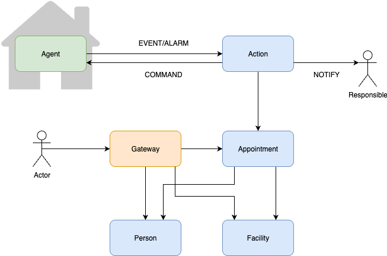

Прошу согласовать тему проектной работы "Интеллектуальное управление объектом" (например офисом, складом, квартирой)
Система, состоит из микросервисов :
- agent        - aгент (отправка сообщений о работе объекта, выполнение команд управления объектом, шаблон inbox/outbox,БД postgresql)
- events       - прием сообщений (шаблон inbox/outbox,БД postgresql)
- auth         - авторизация пользователей (сервер авторизации реализация spring security )
- users        - работа с пользователями (таблица пользователей, справочники категорий пользователей(владельцам объектов и обслуживающему персоналу), направления деятельности пользователей, привязка к объектам, БД postgres)
- objects      - работа с объектами (таблица объектов, классификаторы объектов, БД postgres )
- actions      - обработка сообщений объектов по определенному направлению (реакция на события объекта, например на аварии, отключения воды/электричества, в БД справочники с описанием действий на то или иное событие)
- notification - отправка сообщений пользователям (шаблон outbox , БД postgres)

дополнительный модуль common ?

Smart facility management - Интеллектуальное управление объектом

Описание проекта:
Smart facility management - это микросервисное приложение для управления объектами недвижимости. Система позволяет:
- Регистрировать данные о владельцах и обслуживающем персонале объектов недвижимости
- Регистрировать объекты недвижимости
- Регистрировать события на объектах недвижимости
- Реагировать на события (аварии, ) на объектах недвижимости, отдавая команды о

Архитектура:
- API Gateway - единая точка входа для всех запросов
- Person Service - управление данными о владельцах и обслуживающем персонале  
- Facility Service - управление информацией об объектах недвижимости
- Appointment Service - управление информацией о назначении ответственных
- Action Service - регистрация и реагирирование на объектах недвижимости
- Agent Service - агент, установленный на объекте, предназначенный для сбора информации и управления объектом 
- Message-lib - библиотека для общих форматов обработки сообщений



Технологический стек:
- Java 21
- Spring Boot
- Spring Cloud
- PostgreSQL
- Redis
- Liquibase
- Docker
- Kubernetes (Helm)
- Prometheus + Grafana 
- OpenAPI 3.0
___________________________________________________________________________

Сборка проекта
```shell
gradle clean build
```

Остановка сервисов / Создание образов / Запуск сервисов
```shell
docker-compose down && docker-compose build && docker-compose up -d  
```

Проверим статус всех контейнеров:
```shell
docker ps
```
